<body >
<h1>Interfacing BMP280 sensor with Arduino Mega(Atmega 2560) using SPI communication protocol</h1>

<strong style="font-size:20px">
In this project, we will be reading temperature values from bmp280 using SPI communication protocol with Atmega2560 microcontroller.
</strong>

<section>
<h2>Contents</h2>
<ul  style="background-color:#c5d4cc;padding-top: 10px;padding-bottom: 10px;">

<li><a href="#about"><h3>About SPI</h3></a></li>
<li><a href="#conn"><h3>Connections</h3></a></li>
<li><a href="#bmp"><h3>Registers of BMP20</h3></a></li>
<li><a href="#code"><h3>Code Explanation</h3></a></li>
<li><a href="#exp"><h3>Final Result</h3></a></li>
</li>
</ul>
</section>

<section id="about">
<h1>About SPI</h1>
<p style="font-size:20px">
<strong> SPI (Serial Peripheral Interface) is a full duplex communication protocol. SPI is a four wire interface. Four wires of SPI are SCLK,MOSI,MISO,CS.
</p>

<h3>Serial Clock (SCLK)</h3>
<p style="font-size:18px">
<strong>Serial Clock is used for generating a clock signal at a certain frequency, used for synchronization between master and slave. <strong>&nbsp;</p>

<h3>Master Out Slave In (MOSI)</h3>
<p style="font-size:18px">
<strong>MOSI wire is used for sending data from master to slave. It is used for writing data to the slave .<strong>&nbsp;</p>

<h3>Master In Slave Out (MISO)</h3>
<p style="font-size:18px">
<strong>MISO wire is used for sending data from slave to master. It is used for reading data from the slave. <strong>&nbsp;</p>

<h2>Clock Polarity and Clock Phase </h2>

<h3>Clock Polarity (CPOL)</h3>
<p style="font-size:18px">
<strong>CPOL determines the polarity of the clock, when CPOL=0 ,clock starts from low , when CPOL=1 clock starts from high. <strong>&nbsp;</p>
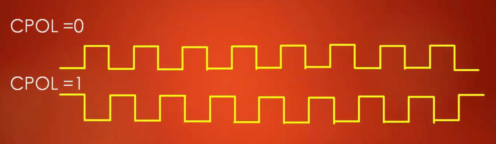

<h3>Clock Phase (CPHA)</h3>
<p style="font-size:18px">
<strong>CPOL determines at which edge of the clock the data is sampled, either  <strong>&nbsp;</p>

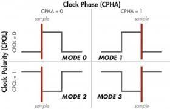
<h4>CPOL and CPHA should selected be selected based on the information given by the slave device.
</section>

<section id="conn">
<h2>Connections</h2>
<strong style="font-size:20px">
1. Connect +3.3v to Vcc  <br>
2. Connect Gnd to Gnd    <br>
3. Connect D52 to SCL    <br>
4. Connect D51 to SDA    <br>
5. Connect D50 to SDD    <br>
6. Connect D53 to CSB    <br>
</strong>
</section>

<section id="bmp">
<h2>Registers of BMP280 </h2>
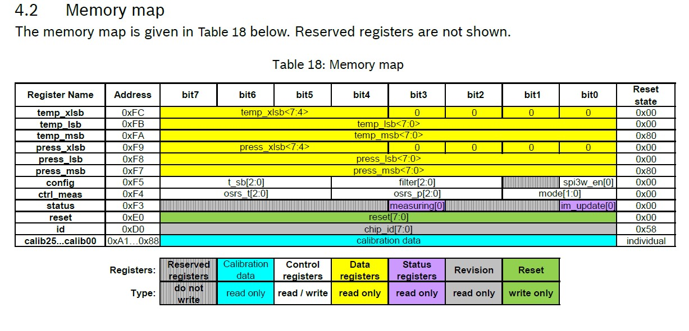

<h3>Sampling</h3>


<h3>Power Modes</h3>

</section>

<h3>SPI Mode in BMP280</h3>
In SPI mode, only 7-bits are used, MSB is used for read/write bit (read-1 and write-0).In write mode,If an address of SPI register is 0xF7, it can be accessed by the address of 0x77.

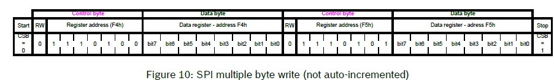


<section id="code">
<h1>Code Explanation</h1>

```
#define SPC_R *((volatile uint8_t*)0x4C) //control register
#define SPS_R *((volatile uint8_t*)0x4D) //status  register
#define SPD_R *((volatile uint8_t*)0x4E) //data    register

#define DDRB_R  *((volatile uint8_t*)0x24)  //data direction of port b 
#define PORTB_R *((volatile uint8_t*)0x25)  //data out of port b 


#define TCCR1A_R *((volatile uint8_t*)0x80)  //timer_1 control register A
#define TCCR1B_R *((volatile uint8_t*)0x81)  //timer_1 control register B
#define TCNT1_R  *((volatile uint16_t*)0x84) //timer_1  counter
#define OCR1A_R  *((volatile uint16_t*)0x88) //timer_1 output compare register A
#define TIMSK1_R  *((volatile uint8_t*)0x6F) //timer_1 interrupt mask register


#define UCSR0_A *((volatile uint8_t*)0xC0) // UART control and status register A
#define UCSR0_B *((volatile uint8_t*)0xC1) // UART control and status register B
#define UCSR0_C *((volatile uint8_t*)0xC2) // UART control and status register C
#define UBBR_0  *((volatile uint8_t*)0xC4)   //Baud rate
#define UDR_0   *((volatile uint8_t*)0xC6)  //data register

```

These are the registers used for configuring SPI,UART1 and timer1.


```

void spi_init(){
	DDRB_R = 0x07; //Pin0(SS) and Pin2(MOSI) are output
	SPC_R  = 0x51; //SPI enable,CPOL and CPHA are zero, master
	PORTB_R = 1;//pin0(SS) is high
}

```
1. Here, Data direction of portB register is configured, where Pin0 and Pin2 are used for as ouput.
2. SPI control register is configured. SPI is enabled, Master select, Clock Phase and Clock polarity are zero, SCK frequency is Fclk/16.

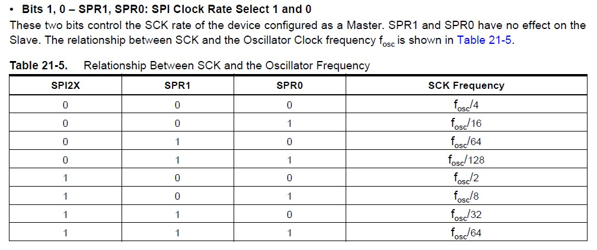<br>
3. Pin0 of PortB is connected to Slave select initial value is high.


```
void uart_init(){
	UCSR0_B = 0x18; //rx and tx enable
	UCSR0_C = 0x06; //8-bit data
	UBBR_0  = 104;  //Baud rate 9600
}
```
1. Receive and Transmit are enabled in UART control and status register B.
2. In control and status register C, Asynchronous USART is selected, parity is disabled, 1-bit stop bit is used,character size is selected as 8-bit.
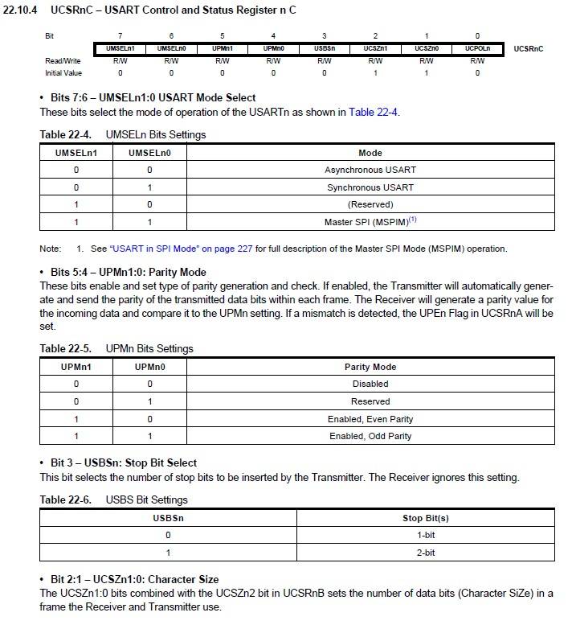
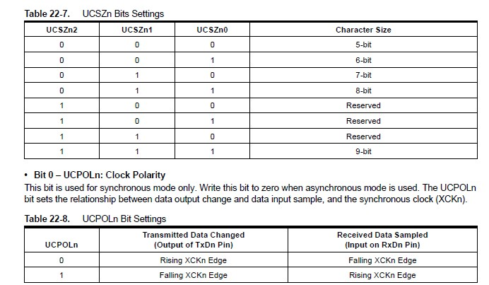<br>

3. Baud rate is selected in UBBR register.

Baud rate calculation:
```BAUD = 9600;
fosc = 16Mhz;

UBBR = ((16mhz)/(16x9600))-1
UBBR = 103.16 = 104 is selected
```

```

void timer_init(){
	
	TCCR1A_R = 0x00;    //normal mode and set on compare match
	TCCR1B_R = 0x0C;    //prescaler = 256 
	TCNT1_R  = 0;       // counter value to zero
	OCR1A_R  = 62500-1; // output compare value
	TIMSK1_R = 0x02;    //enabling output compare A interrupt
	
	sei(); //enable global interrupt
	
}
```
1. Timer1 is selected for normal mode in control register A. Set output to high in compare match is selected.


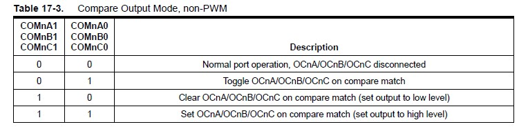
2. In Control register B, prescaler is 256.
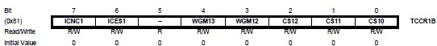
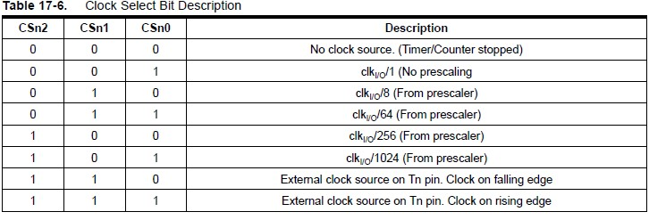
3. Timer 1 counter is initialized to zero.
4. For generating an interrupt for every 1 second, we need to set the register the value of output compare match A register.

    Calculation:
    fosc = 16Mhz , desired_delay = 1sec , prescaler = 256
    OC1A_R = ((fosc * desired_delay)/prescaler) - 1

5. Enabling interrupt for output compare match A.


```
uint8_t spi_trans(uint8_t data){
	SPD_R = data;
	while(!(SPS_R & (1<<7)));
	return SPD_R;
```
This function is used to send and receive data through SPI.


```
    PORTB_R &= ~(0x01);
	spi_trans(0xF4 & 0x7F);//Mode and sampling register ,Normal Mode ,16x sampling
	spi_trans(0xA3);
	spi_trans(0xF5 & 0x7F);//config register,standby_mode-500 and filter and NO SPI
	spi_trans(0x8C);
	PORTB_R |= (0x01);
```
Here, Chip select line is pulled low and data is sent to address location 0xF4 and 0xF5 to configure sampling rate,Mode,Standby.

```
void get_temp(){
	PORTB_R &= ~(0x01);
	spi_trans(0xFA|0x80);
	for(int i=0;i<3;i++){
		data_buffer[i] = spi_trans(0x00); //3 bytes of data
	}
	PORTB_R |= 0x01;
}
```
This function is used to receive temperature data from address 0xFA,0xFB,0xFC,store the values in data_buffer array. Later used to convert to a 20-bit number.

```
void uart_tx(uint8_t data){
	while(!(UCSR0_A & (1<<5)));
	UDR_0 = data;
}
```
This function is used to transmit data using UART.

</section>

<section id="exp">
<h2>Final Output</h2>
Open Data Visualizer on microchip studio and connect to the serial port.
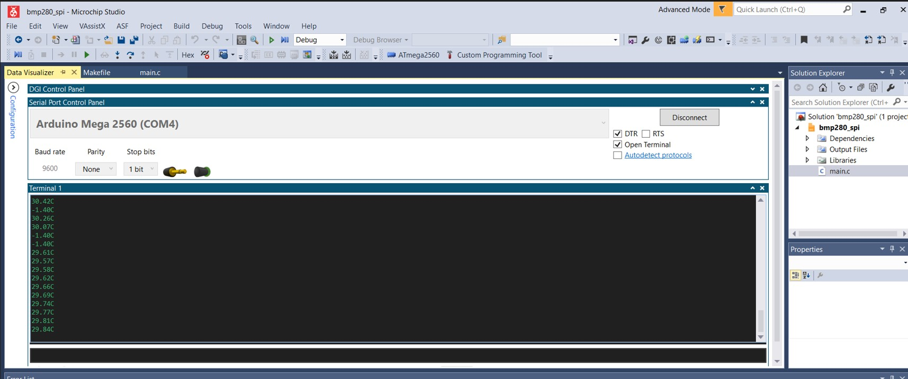

<h3>Logic Analyzer</h3>
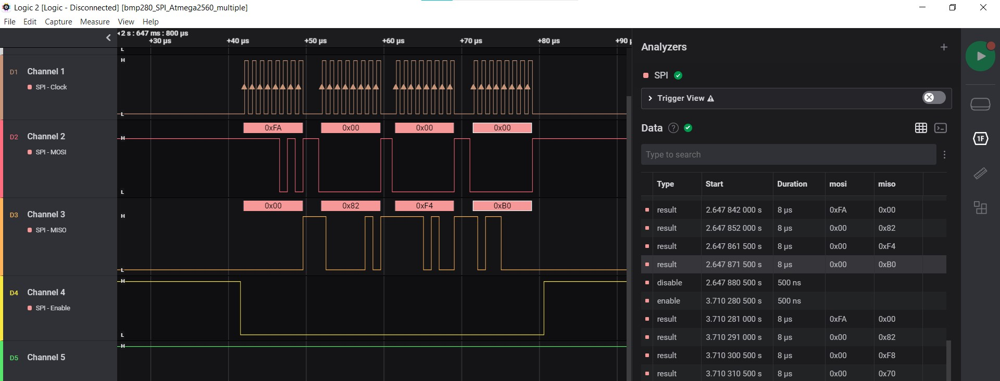
</section>

</body>
